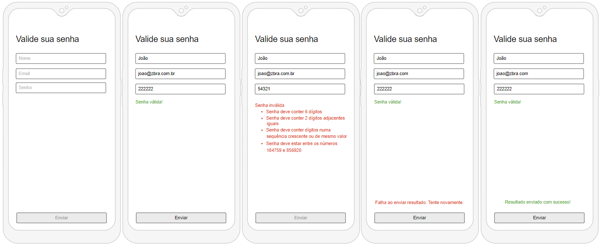

# Processo Seletivo ZBRA - Front End

## Objetivo
Seu objetivo é criar uma simples página que resolva um desafio de senhas descrito abaixo e que seja possível o usuário enviar uma senha através de um formulário com nome e email para uma REST API pré-determinada.

Será fornecido um layout básico para ser seguido na implementação dessa página.

## O desafio
Você é um especialista em segurança tentando quebrar o sistema de uma empresa que o pagou para tal. Investigando falhas na segurança você descobriu que senhas válidas devem seguir um certo padrão:

OK - Senhas são números com 6 dígitos.
OK - A senha deve estar entre 184759-856920.
OK - Dois dígitos adjacentes devem ser iguais (como `22` em `122346`)
OK - Começando da esquerda para a direita, os dígitos devem apenas crescer em valor ou se manter (como `111237` ou `135678`).

Exemplos:
- `222222` é válido (tem o dígito `2` repetido adjacente e nunca diminui em valor)
- `236775` não é válido (diminui o valor dos dígitos no trecho `75`)
- `135789` não é válido (não há duplicação de dígitos adjacentes)

Sua aplicação deve validar se uma senha fornecida pelo usuário é válida e caso seja, só assim poderá submeter o formulário. Caso inválida, informe o usuário quais regras foram violadas.

## Requisitos da aplicação
- Crie uma página web em que o usuário possa entrar com os campos nome, email e senha em um formulário e enviar esses dados para uma API especificada mais abaixo.

OK - O campo **Nome** é obrigatório.
OK - O campo **Email** é obrigatório.
OK - O campo **Email** deve apenas permitir uma entrada com padrão de email.
OK - O botão para submeter o formulário deve ficar desabilitado enquanto o mesmo estiver inválido, isto é, enquanto não há um nome, um email válido ou uma senha válida.
OK - Todos os campos e botão devem ficar desabilitados enquanto estiver mandando o resultado para a api.
OK - As regras da validação de senha podem ser a qualquer momento modificadas, isto é, novas regras podem ser adicionadas e regras existentes podem ser removidas, portanto construa sua aplicação de uma forma que seja fácil fazer tais alterações no futuro.
- O projeto deve conter testes unitários. Você pode escolher o framework para desenvolvê-los de sua preferência.
OK - O projeto deve usar TypeScript ou ECMA 6+.
OK - Forneça um passo a passo de como rodar sua aplicação, por exemplo, um arquivo README.md na raiz do projeto.
- Forneça uma breve descrição da solução utilizada.

## Requisitos Adicionais (Não obrigatórios)
- A página ser responsiva. Sua aparência é diferente numa resolução de celular.
OK - Uso de pré-processador de CSS ou CSS Funcional.
- Testes End to End.

## O que vamos avaliar
- Arquitetura da Solução.
- Boas práticas de Orientação a Objetos.
- Padrões de Projeto.
- Organização.
- Arquitetura CSS (BEM, SMACSS, ITCSS ou qual você desejar).
- Funcionamento e apresentação geral da UI/UX.

## Mocks

### Para desktop
- Estado inicial


- Pronto para enviar resultado


- Senha está inválida


- Após ter enviado com sucesso o resultado


- Após falhar ao enviar resultado


### Para mobile



## API
Você deverá enviar o conteúdo do seu formulário para a seguinte REST API:

(POST) https://61e036950f3bdb0017934eb0.mockapi.io/api/valid-passwords/results

Aqui o schema do body que você deve enviar:

```
{
    "name":"<digite um nome>",
    "email":"<digite um email>",
    "password": "<digite a senha>"
}
```

Espera-se que o response tenha um http status code `201` (created) para considerar como um envio de sucesso. 

Como essa api é apenas um mock, não espere que ela valide seu request, ela sempre retornará `201`. Mas esteja preparado caso não venha o resultado esperado no futuro.